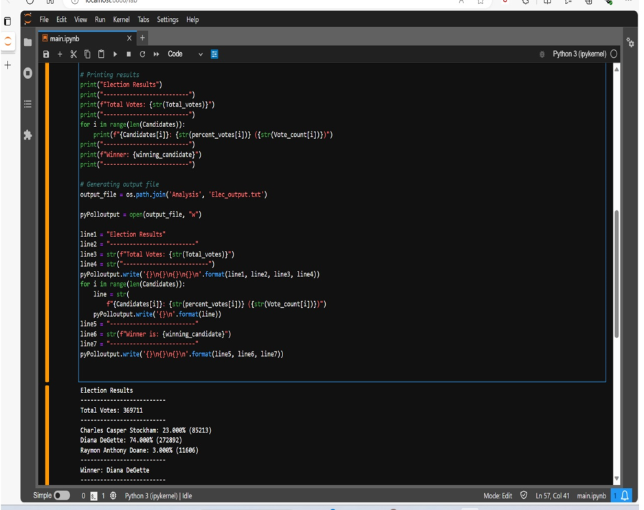

# Python-challenge

# Aim of the Analysis
* Analyse file 'budget_data.csv'
* Calculate unique number of months.
* Calculate total Profit and loss.
* Calculate average Revenue.
* Calculate greatest increase/decrease in profit/loss.

# Observations & Outcomes

* Code is sucessfully reading csv file.
* Code is Error Free & generating desired outcomes.
* Output file was sucessfully generated.
* Code is well organised and commented for better understanding

# Snapshot of outcome

